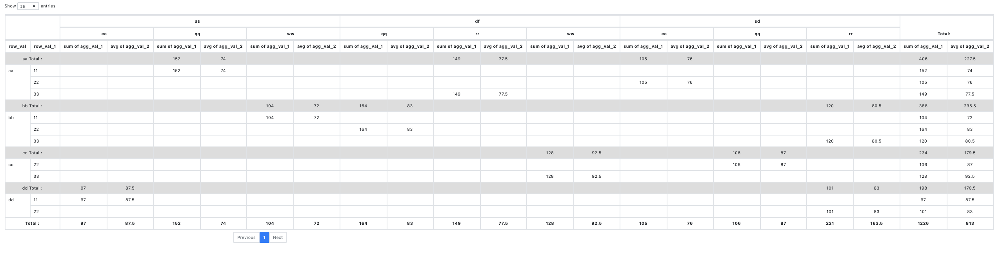

# pivot-table-js

### Javascript Pivot Table Project

#### [개발 배경]

기존의 javascript 기반의 pivot table 조사

원하는 기능

* N 개 row value
* N 개 column value
* N 개 aggregation value
* Row Total
* Column Total
* Sub Total
* 너무 많은 열을 그릴경우 열 제한으로 그리는 열의 갯수를 제한할 수 있어야함
* (추후) custom 조건부서식
* (추후) row, column, aggregation field 추가 옵션 기능들 개선

Open Source 중에서 이 모든 조건에 해당하는 것이 없어 여러 라이브러리들을 조합하여 Pivot Table Sample 개발

#### [ Using Library ]
* jQuery
    - https://jquery.com/
* alasql
    - https://github.com/agershun/alasql
* datatables
    - https://datatables.net/
* datatables-rowsgroup
    - https://github.com/ashl1/datatables-rowsgroup

#### [ Pivot js 필요 파일 ]
* pivot_table/pivot_dao.js
    - Pivot에 필요한 javascript library 실행 함수
* pivot_table/pivot_table.js
    - Pivot 차트를 그리는 함수
* common.js
    - 공통적으로 사용하는 함수들(ex. Empty 확인, 배열 비교 등) 

#### [ parameter Option ]
* target  : div id 명
* name : table 이름
* type : 스타일 적용 테이블 ('table'), 스타일 미적용 테이블('raw')
* data : pivot 테이블에서 사용할 원본 데이터 셋
  * data_list : 테이블에서 보여질 데이터 셋
    * ```
      list 안에 object 형식으로
      {
        key_name : value
      }
      의 리스트 데이터가 필요함
      
      [example]
      [{
        "seq": 1,
        "row_val": "aa",
      }]
      ```
  * row_field : row 로 설정한 key 의 리스트
    * ```
      list 안에 object 형식으로
      {
        key: value
      }
      의 리스트 데이터가 필요함
      
      [example]
      [{
        "key": "row_val"
      }]
      ```
  * column_field : column 으로 설정한 key 의 리스트
    * ```
      list 안에 object 형식으로
      {
        key: value
      }
      의 리스트 데이터가 필요함
      
      [example]
      [{
        "key": "col_val"
      }]
  * aggregation_field : aggregation 으로 설정한 key 의 리스트
    * ```
      list 안에 object 형식으로
      {
        key: value,
        calculate: 계산식
      }
      의 리스트 데이터가 필요함
      
      [example]
      [{
        "key": "agg_val",
        "calculate": "sum"
      }]
    * calculate 는 현재 sum, avg, count, max, min 사용 가능
* style : pivot chart 에 style 옵션 추가
  * pageLength(Number) : 테이블 row 표시 갯수, datatables 의 pageLength setting 에 이용
  * row_total(Boolean) : 행 합계 표시 여부
  * column_total(Boolean) : 열 합계 표시 여부
  * sub_total(Boolean): sub total 표시 여부
  * column_limit : 특정 열의 갯수가 넘어갈때 그려지지 않기 때문에 많을 경우 열에 제한을 둔다. 
    만약에 열이 1000개 이상 될 경우에 피벗을 표현하기에 느리거나 그려지지 않을수도 있다. 
    그래서 200 개로 제한한다면 없는 열을 삭제하기 이전에 전체 열에서 200개의 데이터만 가지고 그리기때문에 조금 더 경량화 될 수 있다.
    * limit(Boolean): 열 제한 여부 확인
    * limit_length(Number): 열 제한 범위

#### [ 실행 ]
```
// example
getPivotTable({
                target: 'result',           
                name: 'result_pivot',       
                type: 'table',              
                data: {
                    data_list: data_list,   
                    row_field: row_field,   
                    column_field: col_field,
                    aggregation_field: aggregation_field 
                },
                style: {
                    pageLength: 25,         
                    row_total: true,        
                    column_total: true,     
                    sub_total: true,        
                    column_limit: {
                        limit: true,
                        limit_length: 101
                    }
                })
```
#### [ Result ]



#### [ History ]

* [ 2020.07.26 ] Pivot Table Library Sample 개발
* [ 2020.12.08 ] Pivot Table 로직 변경
  - 비어있는 열, 행 삭제
  - 열 제한 기능 추가
  - parameter 호출 방식 -> json option 형태로 변경
 
